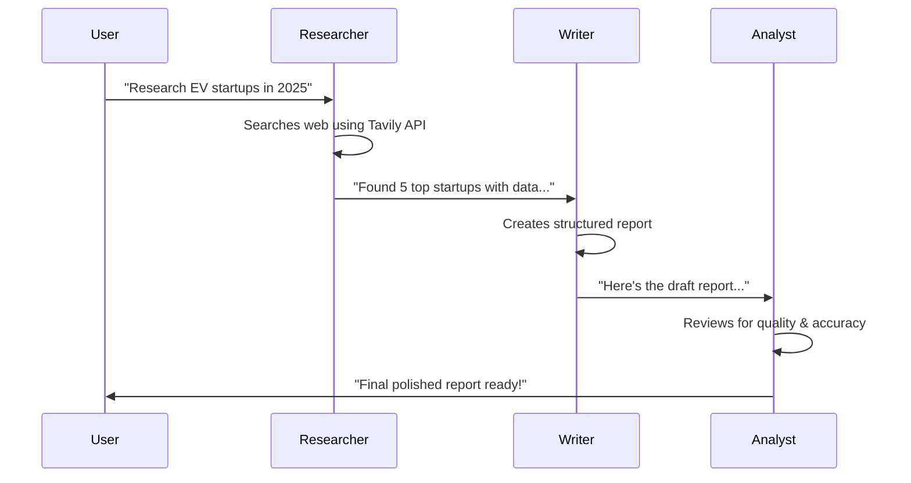

# 🤖 AI Digital Workforce

> **Multi-Agent AI Collaboration Platform** - Watch AI agents work together in real-time to complete complex tasks.

[](https://choosealicense.com/licenses/mit/)
[](https://www.python.org/downloads/)
[](https://nodejs.org/)
[](https://fastapi.tiangolo.com/)
[](https://reactjs.org/)

## 🌟 Overview

AI Digital Workforce is an open-source platform that demonstrates the power of multi-agent AI collaboration. Watch as specialized AI agents—**Researcher**, **Writer**, and **Analyst**—work together in real-time to complete complex tasks, just like a human team would.

### ✨ Key Features

- 🤝 **Real-time Agent Collaboration** - Watch agents communicate and build on each other's work
- 🔍 **Intelligent Web Research** - Researcher agent gathers current information from the web
- ✍️ **Human-like Content Creation** - Writer agent produces high-quality, contextual content
- 🔬 **Quality Analysis & Refinement** - Analyst agent reviews and improves outputs
- 💬 **Human Intervention** - Jump in anytime to guide or redirect the agents
- 📊 **Live Dashboard** - Monitor progress and agent interactions in real-time
- 📄 **Export Ready** - Download results as PDF or Markdown
- 🚀 **Docker Ready** - One-command deployment with Docker Compose

## 🏗️ Architecture

```
┌─────────────────┐    ┌─────────────────┐    ┌─────────────────┐
│   📱 Frontend    │    │   🔧 Backend     │    │   🤖 Agents      │
│                 │    │                 │    │                 │
│ • React + Vite  │◄──►│ • FastAPI       │◄──►│ • Researcher    │
│ • Tailwind CSS  │    │ • WebSocket     │    │ • Writer        │
│ • Socket.IO     │    │ • OpenAPI Docs  │    │ • Analyst       │
│ • React Router  │    │ • SQLite DB     │    │ • LangGraph     │
└─────────────────┘    └─────────────────┘    └─────────────────┘
```

## 🚀 Quick Start

### Prerequisites

- **Docker & Docker Compose** (recommended)
- **OR** Python 3.11+ and Node.js 18+ for local development
- **OpenAI API Key** - [Get here](https://platform.openai.com/api-keys)
- **Tavily Search API Key** - [Get here](https://tavily.com/)

### 🐳 Docker Setup (Recommended)

1. **Clone the repository**
   ```bash
   git clone https://github.com/automate/ai-digital-workforce.git
   cd ai-digital-workforce
   ```

2. **Set up environment variables**
   ```bash
   cp .env.example .env
   # Edit .env and add your API keys
   ```

3. **Start the application**
   ```bash
   # Development mode (with hot reloading)
   docker-compose -f docker-compose.dev.yml up --build

   # Production mode
   docker-compose up --build
   ```

4. **Access the application**
   - 🌐 **Frontend**: http://localhost:3000
   - 📚 **API Docs**: http://localhost:8000/docs
   - 🔧 **Backend**: http://localhost:8000

### 🔧 Local Development Setup

<details>
<summary>Click to expand local setup instructions</summary>

#### Backend Setup

```bash
cd backend
python -m venv venv
source venv/bin/activate  # On Windows: venv\Scripts\activate
pip install -r requirements.txt

# Set up environment
cp .env.example .env
# Edit .env with your API keys

# Run the backend
uvicorn main:socket_app --reload --host 0.0.0.0 --port 8000
```

#### Frontend Setup

```bash
cd frontend
npm install

# Set up environment
cp .env.example .env.local
# Edit .env.local if needed

# Run the frontend
npm run dev
```

</details>

## 🎯 Usage

### Creating Your First Task

1. **Open the dashboard** at http://localhost:3000
2. **Click "Create New Task"**
3. **Enter your task**, for example:
   ```
   Title: Market Research Report
   Description: Research the top 5 electric vehicle startups in 2025 and create a comprehensive market analysis report including funding, market position, and growth potential.
   ```
4. **Watch the magic happen!** 🪄

### Agent Workflow Example



### Human Intervention

At any point during the workflow, you can:
- **Provide guidance**: "Focus more on European companies"
- **Ask questions**: "What about Tesla's impact on these startups?"
- **Redirect**: "Also include battery technology analysis"

## 📚 API Documentation

The backend provides comprehensive OpenAPI documentation:

- **Interactive Docs**: http://localhost:8000/docs
- **ReDoc**: http://localhost:8000/redoc
- **OpenAPI JSON**: http://localhost:8000/openapi.json

### Key Endpoints

| Endpoint | Method | Description |
|----------|--------|-------------|
| `/api/tasks/` | POST | Create a new task |
| `/api/tasks/` | GET | List all tasks |
| `/api/tasks/{id}` | GET | Get task details |
| `/api/messages/task/{id}` | GET | Get task conversation |
| `/socket.io/` | WebSocket | Real-time updates |

## 🧪 Testing

```bash
# Backend tests
cd backend
pytest

# Frontend tests
cd frontend
npm test

# Integration tests
docker-compose -f docker-compose.test.yml up --build
```

## 🛠️ Development

### Project Structure

```
ai-digital-workforce/
├── 📁 backend/              # FastAPI backend
│   ├── 📁 app/
│   │   ├── 📁 agents/       # AI agent implementations
│   │   ├── 📁 api/          # REST API routes
│   │   ├── 📁 models/       # Database models
│   │   ├── 📁 schemas/      # Pydantic schemas
│   │   └── 📁 websocket/    # WebSocket handling
│   ├── 🐳 Dockerfile
│   └── 📄 requirements.txt
├── 📁 frontend/             # React frontend
│   ├── 📁 src/
│   │   ├── 📁 components/   # React components
│   │   ├── 📁 pages/        # Route pages
│   │   ├── 📁 hooks/        # Custom hooks
│   │   └── 📁 services/     # API services
│   ├── 🐳 Dockerfile
│   └── 📄 package.json
├── 🐳 docker-compose.yml   # Production setup
├── 🐳 docker-compose.dev.yml # Development setup
└── 📄 README.md            # You are here!
```

### Adding New Agents

1. Create agent class in `backend/app/agents/`
2. Add agent role to `AgentRole` enum
3. Update orchestrator workflow
4. Add agent avatar in `frontend/public/agents/`

### Environment Variables

#### Backend (.env)
```bash
OPENAI_API_KEY=your_key_here          # Required
TAVILY_API_KEY=your_key_here          # Required  
SECRET_KEY=your_secret_here           # Required
DATABASE_URL=sqlite:///./data/database.db
DEBUG=true
```

#### Frontend (.env.local)
```bash
VITE_API_URL=http://localhost:8000
VITE_WS_URL=ws://localhost:8000
VITE_ENABLE_DEBUG=true
```

## 🚢 Deployment

### Production Deployment

1. **Prepare environment**
   ```bash
   cp .env.example .env
   # Add production API keys and settings
   ```

2. **Deploy with Docker Compose**
   ```bash
   docker-compose up -d --build
   ```

3. **Set up reverse proxy** (optional)
   - Configure nginx/Apache to proxy requests
   - Set up SSL certificates with Let's Encrypt

### Cloud Deployment Options

- **Backend**: Railway, Render, Fly.io
- **Frontend**: Vercel, Netlify, Cloudflare Pages
- **Database**: PostgreSQL on Railway/Supabase for production

## 🤝 Contributing

We love contributions! See [CONTRIBUTING.md](./docs/CONTRIBUTING.md) for guidelines.

### Quick Contribution Steps

1. Fork the repository
2. Create a feature branch: `git checkout -b feature/amazing-feature`
3. Make your changes
4. Run tests: `npm test` and `pytest`
5. Commit changes: `git commit -m 'Add amazing feature'`
6. Push to branch: `git push origin feature/amazing-feature`
7. Open a Pull Request

## 📋 Roadmap

- [ ] **v0.2.0**: Custom agent creation
- [ ] **v0.3.0**: Voice mode (STT/TTS)
- [ ] **v0.4.0**: Multi-task orchestration
- [ ] **v0.5.0**: API marketplace integrations
- [ ] **v1.0.0**: SaaS platform launch

## 🆘 Troubleshooting

<details>
<summary>Common Issues & Solutions</summary>

### Docker Issues

**Problem**: `docker-compose up` fails
```bash
# Solution: Clean and rebuild
docker-compose down
docker system prune -f
docker-compose up --build
```

### API Key Issues

**Problem**: "OpenAI API key not found"
```bash
# Check your .env file exists and has the key
cat .env | grep OPENAI_API_KEY
```

### Port Conflicts

**Problem**: "Port 3000 already in use"
```bash
# Change ports in docker-compose.yml or kill existing processes
lsof -ti:3000 | xargs kill -9
```

</details>

## 📄 License

This project is licensed under the MIT License - see the [LICENSE](LICENSE) file for details.

## 🙏 Acknowledgments

- [FastAPI](https://fastapi.tiangolo.com/) for the amazing backend framework
- [React](https://reactjs.org/) for the frontend library
- [LangChain](https://langchain.com/) for AI/LLM integrations
- [Tailwind CSS](https://tailwindcss.com/) for beautiful styling
- [OpenAI](https://openai.com/) for GPT models
- [Tavily](https://tavily.com/) for web search capabilities

## 📬 Contact

- **GitHub**: [AutoMate Organization](https://github.com/automate)
- **Email**: contact@automate.com
- **Website**: https://automate.com

---

<div align="center">

**Built with ❤️ by AutoMate Team**

[⭐ Star us on GitHub](https://github.com/automate/ai-digital-workforce) • [🐛 Report Bug](https://github.com/automate/ai-digital-workforce/issues) • [💡 Request Feature](https://github.com/automate/ai-digital-workforce/issues)

</div>