# 🤖 AI Digital Workforce

> **Multi-Agent AI Collaboration Platform** - Watch AI agents work together in real-time to complete complex tasks through intelligent orchestration.

<div align="center">

[](https://choosealicense.com/licenses/mit/)
[](https://www.python.org/downloads/)
[](https://nodejs.org/)
[](https://www.docker.com/)
[](https://fastapi.tiangolo.com/)
[](https://reactjs.org/)

**Built by [AutoMate](https://automate.com) - Your AI Automation Partner**

[🚀 Quick Start](#-quick-start-with-docker) • [📚 Documentation](#-documentation) • [🎥 Demo](#-see-it-in-action) • [💬 Discord](https://discord.gg/automate)

</div>

---

## 🌟 Overview

**AI Digital Workforce** is a cutting-edge platform by **AutoMate** that showcases the power of multi-agent AI collaboration using LangGraph orchestration. Watch as specialized AI agents work together like a real team, autonomously completing complex tasks while you maintain full visibility and control.

### 🎯 What Makes This Special?

Unlike traditional AI assistants, our platform employs **multiple specialized agents** that collaborate through an intelligent orchestrator, mimicking how human teams work together. Each agent has unique capabilities and they seamlessly hand off work to each other, creating a true digital workforce.

## ✨ Key Features

<table>
<tr>
<td width="50%">

### 🤝 **Multi-Agent Orchestration**
- **LangGraph-powered** workflow management
- **Researcher Agent**: Gathers real-time web data
- **Writer Agent**: Creates professional content
- **Analyst Agent**: Reviews and refines outputs
- **Supervisor Pattern**: Intelligent task routing

</td>
<td width="50%">

### 💡 **Smart Capabilities**
- **Real-time Collaboration**: Watch agents communicate
- **Human-in-the-Loop**: Intervene at any point
- **Web Research**: Powered by Tavily API
- **GPT-4o-mini**: Latest OpenAI model
- **Export Options**: PDF & Markdown formats

</td>
</tr>
</table>

## 🏗️ Architecture & Tech Stack

```mermaid
graph TB
    subgraph "Frontend - React 19 + Vite"
        UI[React Components]
        WS[Socket.IO Client]
        MD[Markdown Renderer]
    end
    
    subgraph "Backend - FastAPI + LangGraph"
        API[REST API]
        WSS[WebSocket Server]
        ORC[LangGraph Orchestrator]
    end
    
    subgraph "AI Agents"
        RES[🔍 Researcher]
        WRT[✍️ Writer]
        ANL[🔬 Analyst]
    end
    
    subgraph "Infrastructure"
        DB[(MySQL 8.0)]
        CACHE[Redis Cache]
    end
    
    UI <--> API
    WS <--> WSS
    API <--> ORC
    ORC <--> RES
    ORC <--> WRT
    ORC <--> ANL
    API <--> DB
```

<div align="center">



</div>

### 🛠️ Technologies Used

| Layer | Technologies |
|-------|-------------|
| **Frontend** | React 19, Vite, TypeScript, Material-UI, Tailwind CSS v4, Socket.IO Client |
| **Backend** | FastAPI, Python 3.12, LangGraph, LangChain, SQLAlchemy, Pydantic |
| **AI/ML** | OpenAI GPT-4o-mini, Tavily Search API, LangChain Tools |
| **Database** | MySQL 8.0 (Production), SQLite (Development) |
| **DevOps** | Docker, Docker Compose, Nginx, GitHub Actions |
| **Monitoring** | Health checks, WebSocket ping/pong, Structured logging |

## 🚀 Quick Start with Docker

Get up and running in **under 5 minutes** with our Docker setup!

### Prerequisites

- **Docker** 20.10+ ([Install](https://docs.docker.com/get-docker/))
- **Docker Compose** 2.0+ ([Install](https://docs.docker.com/compose/install/))
- **API Keys**:
  - OpenAI API Key ([Get it here](https://platform.openai.com/api-keys))
  - Tavily API Key ([Get it here](https://tavily.com/))

### 🐳 One-Command Deployment

```bash
# 1. Clone the repository
git clone https://github.com/automate/ai-digital-workforce.git
cd ai-digital-workforce

# 2. Configure environment
cp .env.example .env
# Edit .env and add your API keys

# 3. Deploy everything!
./deploy.sh
```

That's it! 🎉 Your AI Digital Workforce is now running at:
- 🌐 **Application**: http://localhost
- 🔧 **API Docs**: http://localhost:8000/docs
- 🗄️ **Database Admin**: http://localhost:8080

### Alternative: Manual Docker Commands

```bash
# Build and start all services
docker-compose up -d --build

# View logs
docker-compose logs -f

# Stop services
docker-compose down
```

## 🎮 See It In Action

### Creating Your First Task

1. **Open the application** at http://localhost
2. **Click "Create New Task"**
3. **Try this example**:
   ```
   Title: Market Analysis Report
   Description: Research the top 5 AI startups in 2024, analyze their 
   funding, technology stack, and market position. Create a comprehensive 
   report with recommendations for investors.
   ```
4. **Watch the agents collaborate** in real-time!

### How Agents Work Together

```mermaid
sequenceDiagram
    participant User
    participant Supervisor
    participant Researcher
    participant Writer
    participant Analyst
    
    User->>Supervisor: Create market analysis task
    Supervisor->>Researcher: Assign research phase
    Researcher->>Researcher: Search web for AI startups
    Researcher->>Supervisor: Found 5 startups with data
    Supervisor->>Writer: Create report from research
    Writer->>Writer: Draft comprehensive report
    Writer->>Supervisor: Report draft ready
    Supervisor->>Analyst: Review and refine
    Analyst->>Analyst: Enhance quality & accuracy
    Analyst->>User: Final report delivered! 📊
```



## 📚 Documentation

### Environment Configuration

Create a `.env` file with the following:

```env
# Required API Keys
OPENAI_API_KEY=sk-...your-key-here
TAVILY_API_KEY=tvly-...your-key-here

# MySQL Configuration (Docker)
MYSQL_ROOT_PASSWORD=secure_password_here
MYSQL_DATABASE=ai_workforce
MYSQL_USER=ai_user
MYSQL_PASSWORD=secure_password_here

# Application Settings
SECRET_KEY=your-secret-key-here  # Generate: openssl rand -hex 32
DEBUG=false
LOG_LEVEL=INFO

# Service Ports (optional)
FRONTEND_PORT=80
BACKEND_PORT=8000
MYSQL_PORT=3306
ADMINER_PORT=8080
```

### API Endpoints

| Endpoint | Method | Description |
|----------|--------|-------------|
| `/api/tasks/` | POST | Create a new AI task |
| `/api/tasks/` | GET | List all tasks (paginated) |
| `/api/tasks/{id}` | GET | Get task details & status |
| `/api/messages/task/{id}` | GET | Get agent conversation |
| `/socket.io/` | WS | Real-time agent updates |
| `/docs` | GET | Interactive API documentation |

### WebSocket Events

```javascript
// Connect to real-time updates
socket.on('agent_message', (data) => {
  console.log(`${data.agent_role}: ${data.message}`);
});

socket.on('task_completed', (data) => {
  console.log('Task finished!', data.deliverable);
});
```

## 🚢 Deployment Options

### Deploy to AWS EC2

```bash
# 1. Launch Ubuntu 22.04 instance (t3.medium or larger)
# 2. SSH into instance
ssh -i your-key.pem ubuntu@your-ec2-ip

# 3. Install Docker
curl -fsSL https://get.docker.com | sh
sudo usermod -aG docker ubuntu

# 4. Clone and deploy
git clone https://github.com/automate/ai-digital-workforce.git
cd ai-digital-workforce
cp .env.example .env
# Configure your .env file
./deploy.sh
```

### Deploy to DigitalOcean

Use our one-click deploy button or follow the EC2 instructions with a Ubuntu droplet.

### Deploy to Railway/Render

Check our [deployment guide](DEPLOYMENT.md) for platform-specific instructions.

## 🧪 Development Setup

<details>
<summary>Local Development Instructions</summary>

### Backend Development

```bash
cd backend
python3 -m venv venv
source venv/bin/activate  # Windows: venv\Scripts\activate
pip install -r requirements.txt
cp .env.example .env
# Add your API keys to .env
uvicorn main:socket_app --reload --host 0.0.0.0 --port 8000
```

### Frontend Development

```bash
cd frontend
npm install
npm run dev
```

### Running Tests

```bash
# Backend tests
cd backend
pytest

# Frontend tests
cd frontend
npm test

# Integration tests
docker-compose -f docker-compose.test.yml up
```

</details>

## 🤝 Contributing

We welcome contributions! AutoMate believes in building together with the community.

1. Fork the repository
2. Create your feature branch (`git checkout -b feature/AmazingFeature`)
3. Commit your changes (`git commit -m 'Add AmazingFeature'`)
4. Push to the branch (`git push origin feature/AmazingFeature`)
5. Open a Pull Request

## 🗺️ Roadmap

- [x] **v0.1.0** - Multi-agent orchestration with LangGraph
- [x] **v0.2.0** - Real-time WebSocket updates
- [x] **v0.3.0** - Docker deployment ready
- [ ] **v0.4.0** - Custom agent creation UI
- [ ] **v0.5.0** - Voice interaction mode
- [ ] **v0.6.0** - Agent marketplace
- [ ] **v1.0.0** - Enterprise features

## 🆘 Troubleshooting

<details>
<summary>Common Issues & Solutions</summary>

### Docker Issues

```bash
# Reset everything
docker-compose down -v
docker system prune -f
docker-compose up --build
```

### Port Conflicts

```bash
# Change ports in .env file
FRONTEND_PORT=3000
BACKEND_PORT=8001
```

### Database Connection

```bash
# Check MySQL is running
docker-compose ps mysql
docker-compose logs mysql
```

</details>

## 📄 License

This project is licensed under the MIT License - see the [LICENSE](LICENSE) file for details.

## 🙏 Acknowledgments

- [LangChain](https://langchain.com/) & [LangGraph](https://github.com/langchain-ai/langgraph) for the orchestration framework
- [OpenAI](https://openai.com/) for GPT-4o-mini
- [Tavily](https://tavily.com/) for web search capabilities
- [FastAPI](https://fastapi.tiangolo.com/) for the amazing backend framework
- [React](https://reactjs.org/) team for React 19

## 👥 About AutoMate

**[AutoMate](https://automate.com)** is your AI Automation Partner, specializing in building intelligent automation solutions that transform how businesses operate. We believe in the power of AI to augment human capabilities, not replace them.

### Our Mission
Democratize AI automation by creating tools that are powerful yet accessible, enabling businesses of all sizes to leverage the power of artificial intelligence.

### Connect With Us
- 🌐 **Website**: [automate.com](https://automate.com)
- 📧 **Email**: hello@automate.com
- 💼 **LinkedIn**: [AutoMate AI](https://linkedin.com/company/automate-ai)
- 🐦 **Twitter**: [@AutoMateAI](https://twitter.com/AutoMateAI)
- 💬 **Discord**: [Join our community](https://discord.gg/automate)

---

<div align="center">

### 🌟 **Star us on GitHub to support the project!**

**Built with ❤️ by [AutoMate](https://automate.com) - Your AI Automation Partner**

[⭐ Star](https://github.com/automate/ai-digital-workforce) • [🐛 Report Bug](https://github.com/automate/ai-digital-workforce/issues) • [💡 Request Feature](https://github.com/automate/ai-digital-workforce/issues) • [📖 Docs](https://docs.automate.com)

</div>